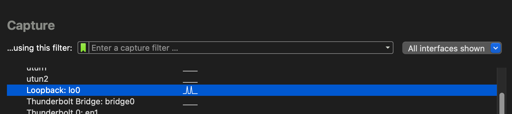
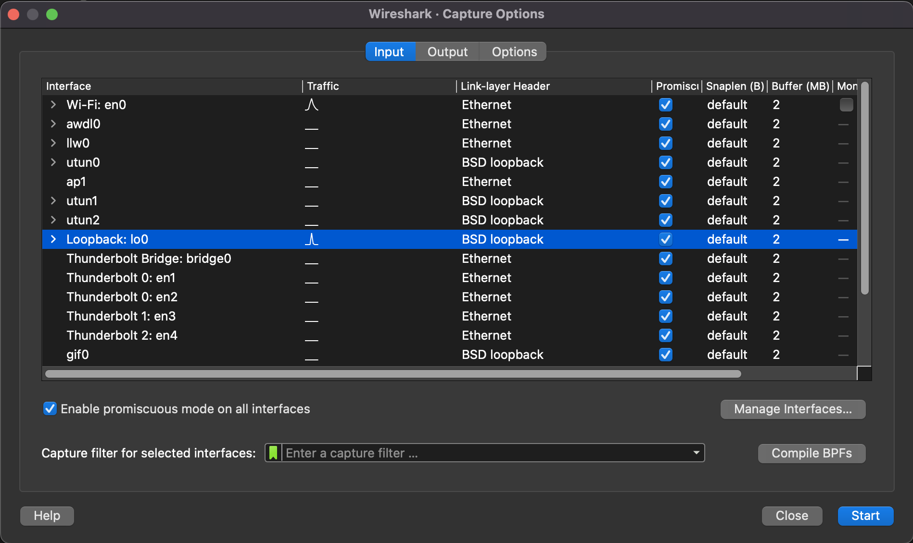
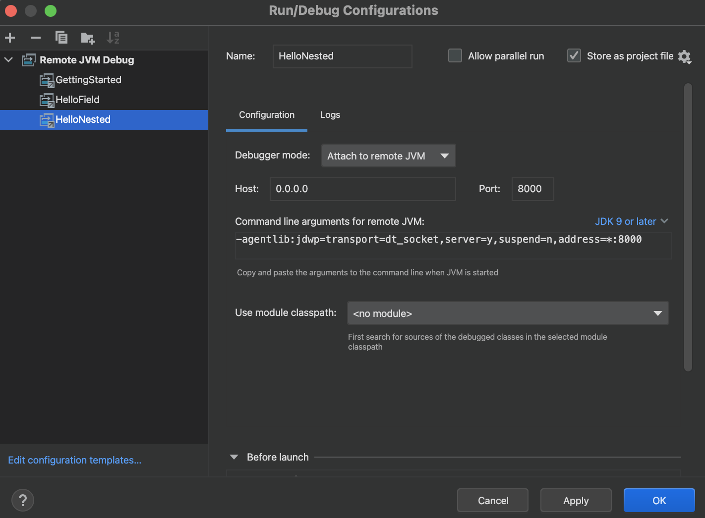
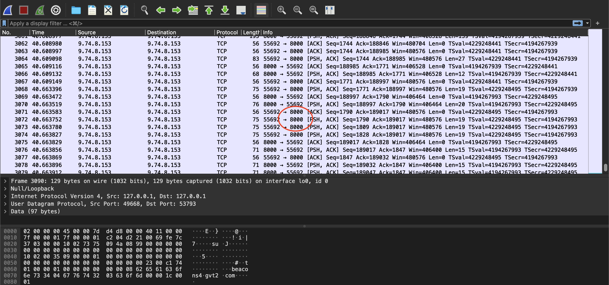
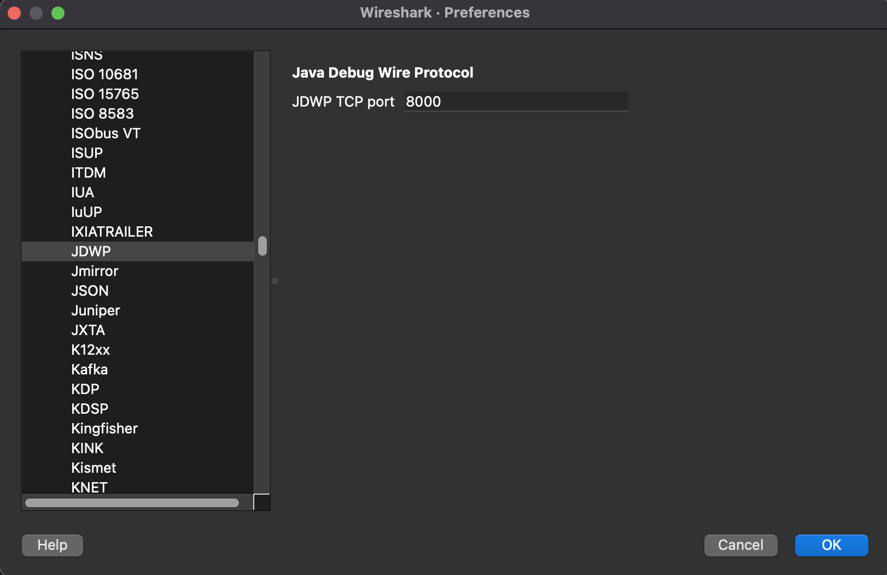
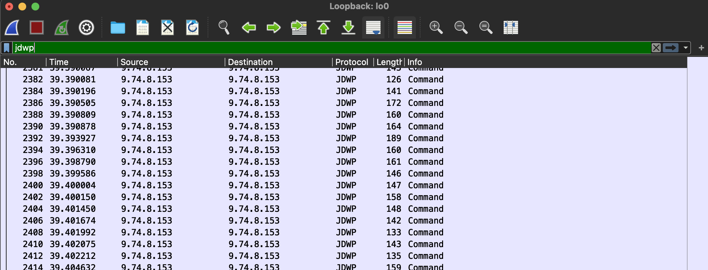
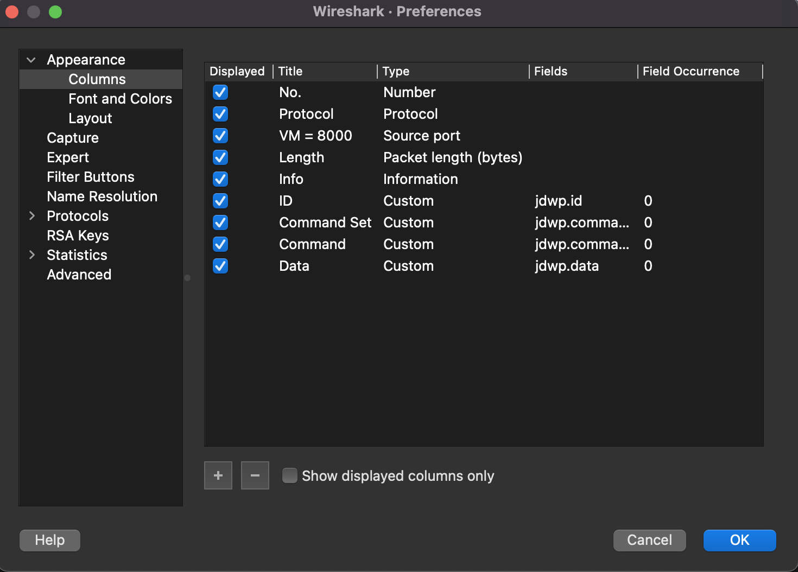
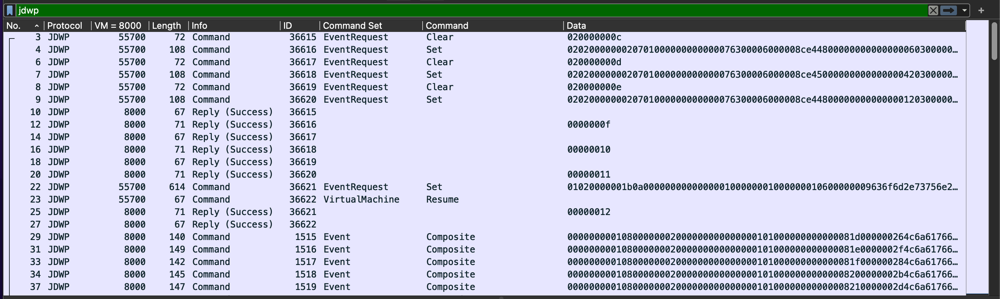
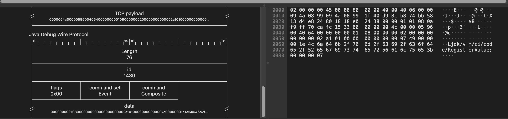
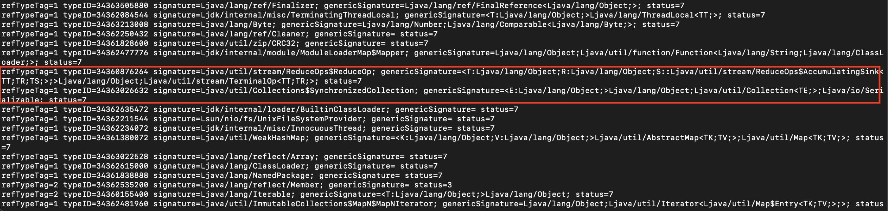

# Developer tool: Wireshark

Wireshark is an open-source packet analyzer which has the capability to sniff network traffic, decode packets, and interpret them.
To be able to contribute to this project, it is important to understand how JDWP works in a real-world setting.
Wireshark is thus helpful in providing the tools to break down the command and reply packets sent between the debugger and debuggee.

Follow these steps to install and use Wireshark.

### Installation
Download and install the latest version of Wireshark [here](https://www.wireshark.org/#download). JDWP dissectors are supported currently in versions 3.4.0 to 3.6.6, so make sure to install a version that is compatible with JDWP.

### Starting Wireshark
We can either provide Wireshark with a `pcapng (PCAP Next Generation Dump File)` capture file or capture new traffic ourselves.

For the former, you can find a pcapng capture file [here](hellonested.pcapng) for the `HelloNested.java` program. This capture file includes packets for the JDWP-Handshake, step in, step out, step over, and continue. Load the file into Wireshark. 

Otherwise, we can start a remote debugging session that runs JDWP at a specified port and point Wireshark to that port to capture the traffic. Follow these steps:
1. Open Wireshark and click on `Capture` 
2. A window will pop up prompting you to select an interface. Choose the `Loopback` interface 
3. Hit `Start` and Wireshark should begin capturing `TCP` traffic. 
4. Next, we will need to start a debugging session. Take `Fib.java` in `nativejdbExamples` as an example. Run the following command in the `nativejdbExamples/src/Fib/` directory to start a remote debugging session
    1. If you encounter a`Class not found` error, it might be because of one of the following
        1. `.java` is not included as an extension of the debuggee file
        2. You are not in the directory which contains the debuggee file
    2. The default TCP that JDWP is run on is port 8000, which is what we will be using. You can use other ports, too

```
java -agentlib:jdwp=transport=dt_socket,server=y,suspend=y,address=*:8000 Fib.java
```

If the command is run successfully, you should get something like `Listening for transport dt_socket at address: 8000`

5. In your favorite IDE, configure a remote debugging session to point to the same port (8000 in this case). For example, it will look like this in IntelliJ 
6. Run the remote debugging session from your IDE
7. As you set breakpoints, step in/over/out, Wireshark should be able to capture the commands and replies associated with those actions. Verify that this is the case if you see port 8000 being captured in Wireshark 
8. Once you are done with debugging, stop Wireshark, and you should now have a complete network traffic with JDWP to analyze

### Configuring Wireshark

After loading or capturing network traffic, we will now configure Wireshark to filter out unnecessary information in TCP transaction, recognize and decode TCP packets into JDWP ones. 

1. Right click on any packet with port 8000 > Protocol Preference > Data > Open Data Preference 
2. In the `Protocols` drop-down list, look for `JDWP`
3. In the new window that pops up, change `JDWP TCP port` to `8000` or which ever port you used 
4. In the top display filter bar, filter for `jdwp`. Now you should only see JDWP packets 
5. We can further dissect the information to show appropriate information in columns. Go to Wireshark > Preferences > Appearance > Columns. 
6. Add new columns, edit the title, change the type to `Custom`, and under `Fields`, change each corresponding ones to the appropriate data to display 
7. Now Wireshark should provide more useful information for each packet 

### Additional tips 
* In Preferences > Appearance > Layout, you can select one of the panes to include `Packet Diagram` to visualize the JDWP architecture 
* Next time you use Wireshark to capture JDWP packets, Wireshark should be all configured and ready to go, so all you need to do is `Configuring Wireshark`'s step 4 to filter for JDWP packets!

# Developer tool: jdwptracer 

[jdwptracer](https://github.com/jeffmaury/jdwptracer) is a proxy that traces JDWP packets like Wireshark. It provides additional information
that Wireshark does not. As you may realize with Wireshark, it does not break down the 
data portion of each command and reply. Instead of matching the byte data to each individual fields describes by [JDWP documentation](https://docs.oracle.com/javase/8/docs/platform/jpda/jdwp/jdwp-protocol.html#JDWP_Tag), 
we can save time using jdwptracer. 

Follow instructions on the jdwptracer GitHub page. If working, you should see something like the following. 



Special thanks to Jeff Maury from Red Hat, who developed this tracer.  